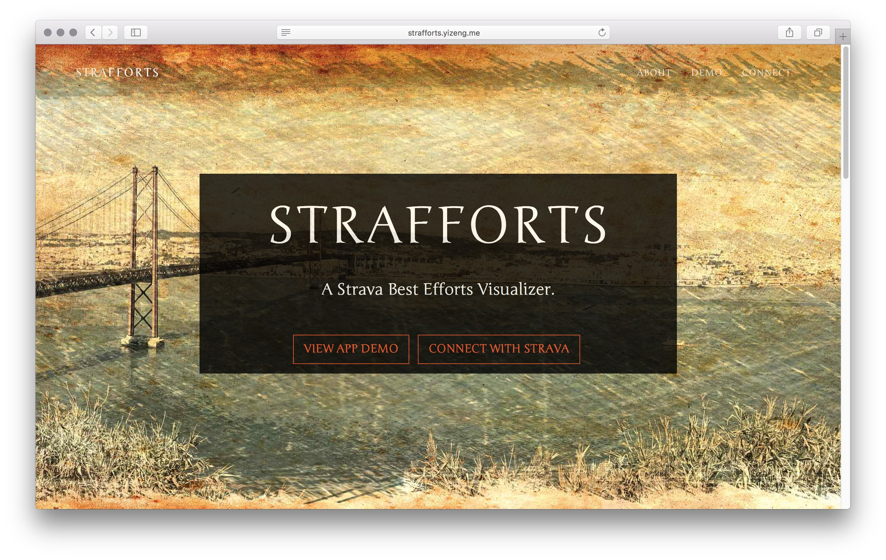
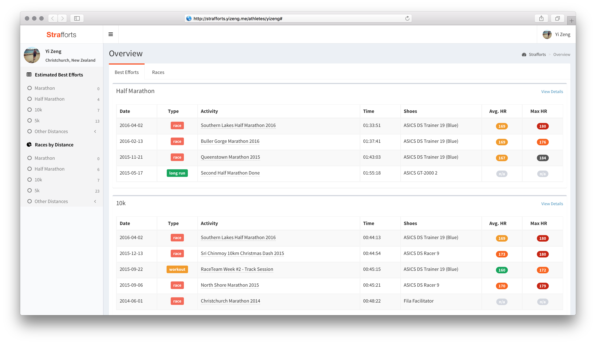
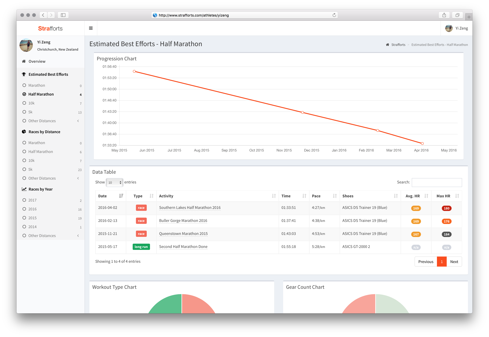
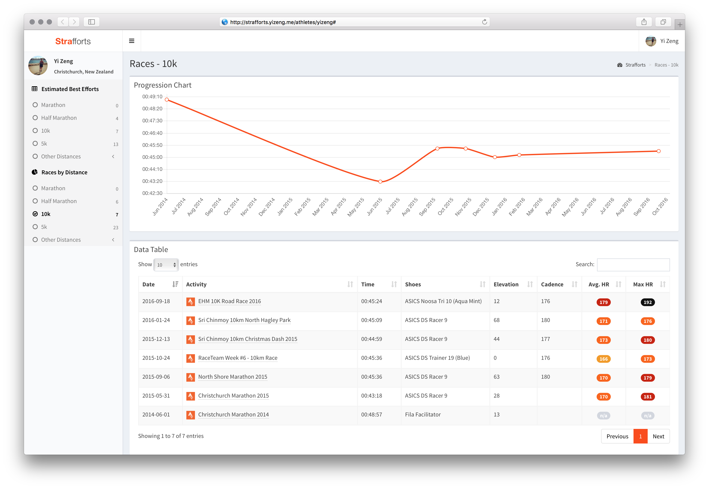

# Strafforts 

### A Visualizer for Strava Estimated Best Efforts

Strafforts is a web app that calls [Strava API][Strava API]
to fetch athletes' [estimated best efforts][Strava Support] data
and visualize them in forms of data tables, line charts and pie charts,
in such way athletes can perform some analysis like half marathon PB progression,
fastest shoes used for a 10K race, how often 5K PB gets set, etc.

Originally developed as a personal open source [Ruby console app][strava-best-efforts] just for fun,
Strafforts has now been rewritten in [Ruby on Rails][Ruby on Rails],
so that athletes can connect Strafforts with their Strava accounts and see visualized best efforts automatically.

### Demo

http://strafforts.com/

### What are 'Estimated Best Efforts'?

Quoting from [Strava Support][Strava Support]:

> Estimated Best Efforts are automatically calculated using your GPS-based running activity,
  and reflect your fastest times for benchmark distances such as 1 mile, 5km, 10km, and half marathon.
  Strava can find your best effort at any point in each running activity.
  We do not require that a best effort starts at a mile split.

![Side by side Best Efforts][Side by side Best Efforts Image]
![Strava Best Efforts][Strava Best Efforts Image]

## Installation & Development

Strafforts should just work fine at http://strafforts.com/,
that you can connect with your Strava account and view your best efforts data once they have been retrieved.

However, if you want to create your own Strafforts instance or setup it on your machine,
please follow the [installation and development guide](docs/installation-and-development-guide.md).

## Acknowledgements

See [Acknowledgements](docs/acknowledgements.md) page for a comprehensive list.

## Contributing

Contribution are always **welcome and recommended**!

As I'm actually a .NET developer by day,
Strafforts is my first Ruby on Rails app that helps me learning the framework and creates something useful for analyze my running.
Since it's so amateur, surely there are so much can be improved from a Ruby developer's point view.
I will try my best to improve this and make it more useful for everyone.

Got any questions? Check out the [Q&A page](docs/q-and-a.md) first to see if it's been asked before.
If you any feature idea, or are running into problems, please raise an issue on GitHub.
If you want to make code changes, feel free to create PRs.

## License
Strafforts is a project developed and maintained by [Yi Zeng][yizeng.me], licensed under [MIT License](LICENSE).

[Strava API]: https://strava.github.io/api/
[Strava Support]: https://support.strava.com/hc/en-us/articles/216917127-Estimated-Best-Efforts-for-Running
[Side by side Best Efforts Image]: https://support.strava.com/attachments/token/B2NpmmMYGEVEzCJn7ZjoMFtsk/?name=Side+by+Side-+Best+Effort.png
[Strava Best Efforts Image]: https://support.strava.com/attachments/token/UJw9NjMB5AZSqRm8sst8kUqUy/?name=activity+-+Best+Effort.png
[strava-best-efforts]: https://github.com/yizeng/strava-best-efforts
[Ruby on Rails]: http://rubyonrails.org/
[yizeng.me]: http://yizeng.me
